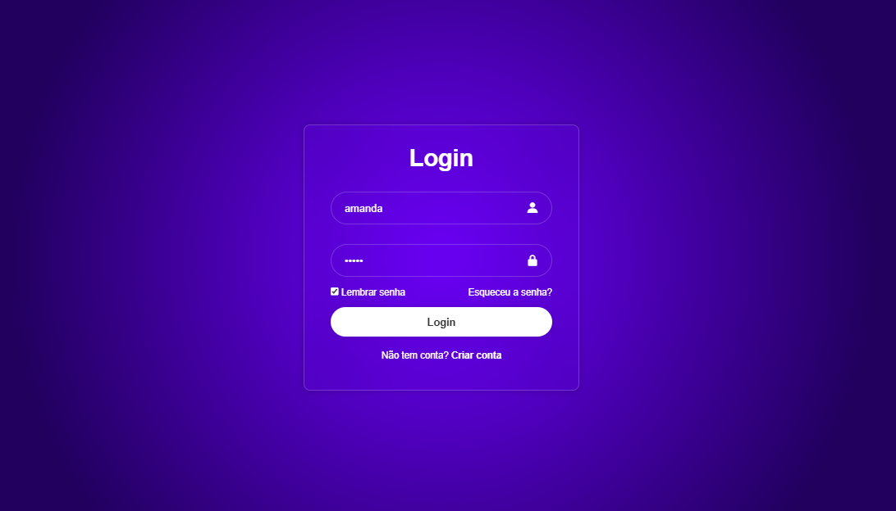

# 🔐 Página de Login (Somente Interface)

Este projeto é uma **página de login estilizada** utilizando apenas **HTML** e **CSS**, criada com o objetivo de treinar a criação de interfaces modernas e responsivas. **Não há funcionalidades de autenticação**, ou seja, os dados digitados não são processados nem enviados para nenhum servidor.

## 🧩 Funcionalidades visuais

- Campo para nome de usuário ou e-mail
- Campo para senha
- Botão de "Login"
- Estilo moderno com foco em cores, espaçamento e centralização
- Responsivo em diferentes tamanhos de tela

## ❌ Aviso importante

> Esta página **não possui backend**. Ou seja, é apenas uma simulação visual. Nenhuma verificação de usuário ou autenticação é realizada.

## 📁 Estrutura do Projeto

- `login.html` – Estrutura HTML da página
- `style.css` – Estilos da interface (pode estar embutido ou em arquivo separado)

## 🚀 Como visualizar

1. Baixe ou clone este repositório
2. Abra o arquivo `login.html` em qualquer navegador
3. A interface de login será exibida

## 📸 Exemplo

## 🎓 Propósito Educacional

Este projeto foi feito para praticar o uso de HTML e CSS em páginas simples. Ele pode servir como base para projetos mais avançados que incluam JavaScript e conexão com banco de dados.

---

